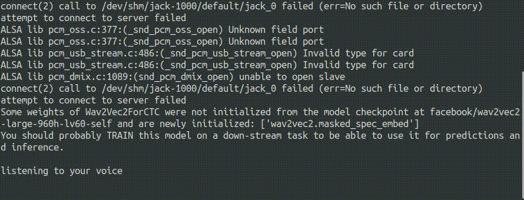

# automatic speech recognition with wav2vec2 

Use any wav2vec model with a microphone.



## Setup

I recommend to install this project in a virtual environment.

```
python3 -m venv ./venv
source ./venv/bin/activate
pip install -r requirements.txt
```

Depending on linux distribution you might encounter an **error that portaudio was not found** when installing pyaudio. For Ubuntu you can solve that issue by installing the "portaudio19-dev" package.

```
sudo apt install portaudio19-dev
```

Finally you can test the speech recognition:

```
python live_asr.py
```

### Possible Issues:

* The code uses the systems default audio device. Please make sure that you set your systems default audio device correctly. 

* "*attempt to connect to server failed*" you can safely ignore this message from pyaudio. It just means, that pyaudio can't connect to the jack audio server. 


## Usage

You can use any **wav2vec2** model from the [huggingface model hub](https://huggingface.co/models?pipeline_tag=automatic-speech-recognition&search=wav2vec2). Just set the model name, all files will be downloaded on first execution.

```python 
from live_asr import LiveWav2Vec2

english_model = "facebook/wav2vec2-large-960h-lv60-self"
german_model = "maxidl/wav2vec2-large-xlsr-german"
asr = LiveWav2Vec2(german_model,device_name="default")
asr.start()

try:        
    while True:
        text,sample_length,inference_time = asr.get_last_text()                        
        print(f"{sample_length:.3f}s"
        +f"\t{inference_time:.3f}s"
        +f"\t{text}")
        
except KeyboardInterrupt:   
    asr.stop()  
```